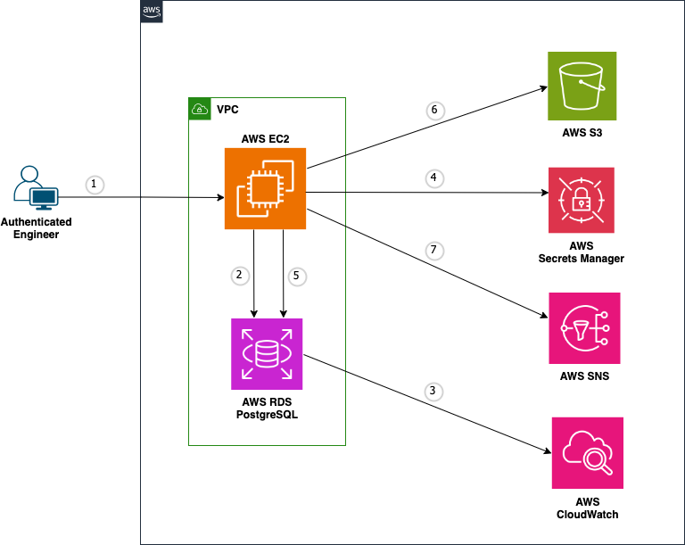
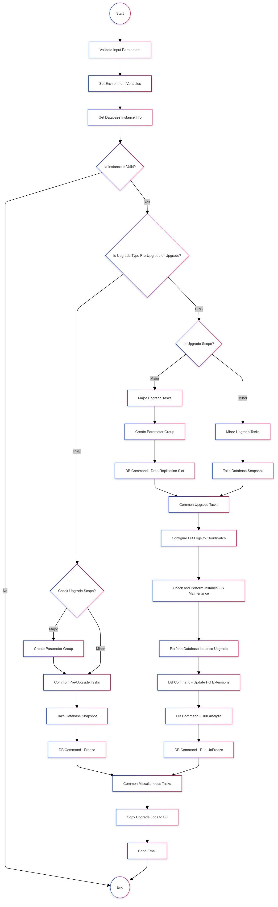
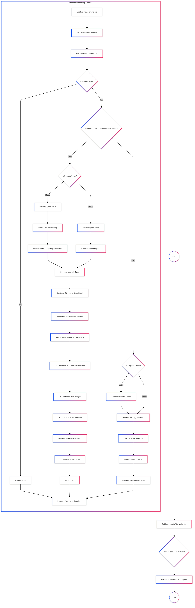
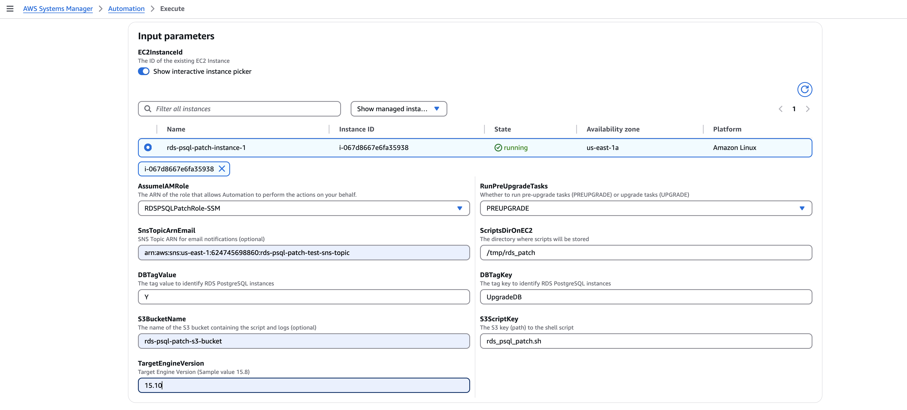
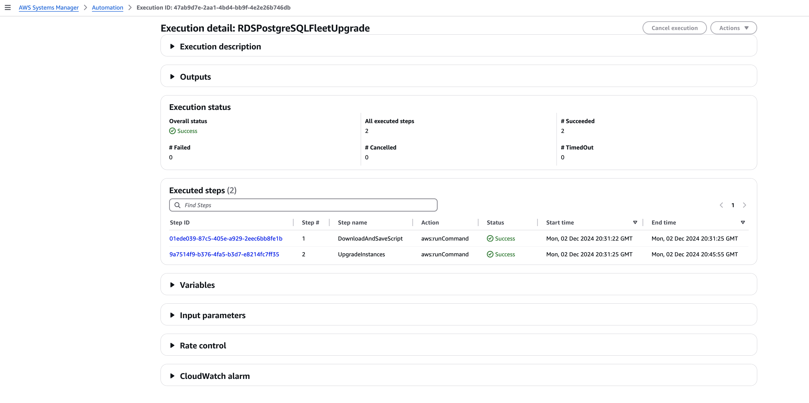
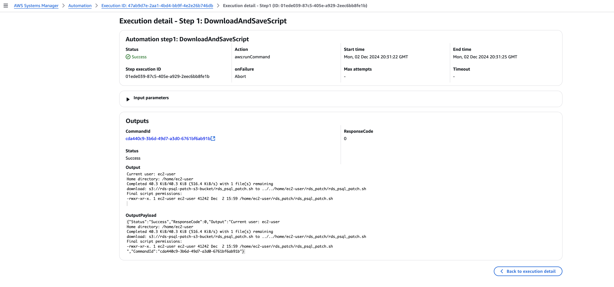

# Automate PostgreSQL Version Upgrades on Amazon RDS

Managing the lifecycle of your PostgreSQL database is essential for maintaining optimal performance, security, and feature access. Even with Amazon RDS for PostgreSQL simplifying operations, version upgrades remain a critical task for database and devops engineers, especially in large-scale environments. Manual patching or upgrades can introduce challenges such as extended downtime and potential human errors, both of which can disrupt application stability.

Automation can help address these challenges. By leveraging AWS Command Line Interface (CLI) commands within a Unix shell script, you can automate the upgrade process, including prerequisite checks and upgrading a single RDS instance. To scale this approach for multiple instances, a Unix wrapper script can loop through each RDS instance, executing the upgrade process simultaneously.

Furthermore, you can integrate with AWS System Manager using RDS tagging strategy to upgrade entire fleet of RDS instances across multiple environments — such as Development, Staging, and Production — in a consistent and automated manner.

In this repository, we will guide you through setting up automation for pre-upgrade checks and upgrading one or more RDS PostgreSQL instances.

<br>

## Features

- Automate Amazon RDS PostgreSQL version upgrades
- Perform prerequisite checks before upgrading
- Upgrade a single RDS instance
- Scale the upgrade process to multiple RDS PostgreSQL instances
- Integrate with AWS System Manager for fleet-wide upgrades

<br>

## Architecture

**Upgrade single RDS PostgreSQL instance:**



      1. User connects to EC2 and executes the upgrade script
      2. Checks if RDS instance is valid
      3. Configures RDS instance to push DB and upgrade logs to CloudWatch if not configured already
      4. Retrieves secret from secret manager
      5. Performs upgrade tasks
      6. Pushes log files to S3
      7. Sends email notification.

<br>

**Upgrade fleet of RDS PostgreSQL instances using AWS Systems Manager:**


      1. User connects to AWS Systems Manager console
      2. Execute automation job "RDSPostgreSQLFleetUpgrade"
      3. Connects to S3 and downloads the upgrade shell script to ec2 instance
      4. Connects to ec2 instance and identifies list of RDS PostgreSQL instances based on tag key/value pair: For e.g.: UpgradeDB = Y
      5. For each RDS PostgreSQL Instance identified, configures RDS instance to push DB and upgrade logs to CloudWatch if not configured already
      6. Retrieves secret from secret manager
      7. Performs upgrade
      8. Pushes log files to S3
      9. Sends email notification.

<br>

## High-level Tasks with PREUPGRADE and UPGRADE options

**PREUPGRADE Tasks:**

      1. Create new parameter group
      2. Take database snapshot
      3. VACUUM FREEZE.

<br>

**UPGRADE Tasks:**

      1. Create new parameter group
      2. Take database snapshot
      3. Drop replication slot(s)
      4. OS maintenance
      5. Database version upgrade
      6. PostgreSQL extensions update
      7. Analyze
      8. VACUUM (unfreeze).

<br>

## Flow Charts

**Upgrade single RDS PostgreSQL instance:**



<br>

**Upgrade fleet of RDS PostgreSQL instances using AWS Systems Manager:**



<br>

## Setup - Upgrade single RDS PostgreSQL instance

1. Prerequisites:
   
   ```
     1. AWS resources required:
   
        - EC2 instance primarily to store and run upgrade script, and store log files
   
               -- Required Tools:
                     --- AWS CLI
                     --- PostgreSQL client utility
                     --- jq for JSON processing
   
        - IAM profile attached to EC2 instance with necessary permissions
   
                -- [create_rds_psql_patch_iam_policy_role_cfn.yaml] can be used to create an IAM policy and role.
                         --- Modify resource names appropriately
   
                -- Attach this IAM role to ec2 instance

        - RDS instance(s) with:
   
                -- VPC configuration
                -- Subnet group(s)
                -- Security group(s)
                -- Parameter group
                -- AWS Secrets Manager secret attached to each RDS instance
                -- [create_rds_psql_instance_cfn.yaml] can be used to create DB Parameter group and RDS PostgreSQL instance
                      --- Modify resource names appropriately
      
        - S3 bucket to store scripts and logs
   
        - SNS topic for notifications

     2. Network Configuration:
   
        - Database security group must allow inbound traffic from EC2 instance
      ```
   
3. Clone the repository:
   ```
   git clone https://github.com/aws-samples/rds-postgres-upgrade.git
   ```
   
4. Navigate to the project directory:
   ```
   cd rds-postgres-upgrade
   ```
   
5. Update environment variables in the shell script *[rds_psql_patch.sh]*, if required (optional)

6. Identify minor or major upgrade path. Below is an example AWS CLI command to identify appropriate upgrade path for RDS PostgreSQL 14.9
 
      ```
            aws rds describe-db-engine-versions \
              --engine postgres \
              --engine-version 14.9 \
              --query "DBEngineVersions[].ValidUpgradeTarget[].{EngineVersion:EngineVersion,IsMajorVersionUpgrade:IsMajorVersionUpgrade}" \
              --output table

            --------------------------------------------
            |         DescribeDBEngineVersions         |
            +----------------+-------------------------+
            |  EngineVersion |  IsMajorVersionUpgrade  |
            +----------------+-------------------------+
            |  14.10         |  False                  |
            |  14.11         |  False                  |
            |  14.12         |  False                  |
            |  14.13         |  False                  |
            |  14.14         |  False                  |
            |  14.15         |  False                  |
            |  15.4          |  True                   |
            |  15.5          |  True                   |
            |  15.6          |  True                   |
            |  15.7          |  True                   |
            |  15.8          |  True                   |
            |  15.9          |  True                   |
            |  15.10         |  True                   |
            +----------------+-------------------------+
      ```

7. Syntax:

   ```
         ./rds_psql_patch.sh [db-instance-id] [next-engine-version] [run-pre-check]
         ./rds_psql_patch.sh [rds-psql-patch-test-1] [15.6] [PREUPGRADE|UPGRADE]

         PREUPGRADE = Run pre-requisite tasks, and do NOT run upgrade tasks
         UPGRADE = Do not run pre-requisite tasks, but run upgrade tasks

         Note: Review this document [https://docs.aws.amazon.com/AmazonRDS/latest/PostgreSQLReleaseNotes/postgresql-versions.html]
               for appropriate minor or major supported verion (a.k.a appropirate upgrade path)
   ```
      
8. Example Usage:

   ```
           nohup ./rds_psql_patch.sh rds-psql-patch-instance-1 14.10 PREUPGRADE >rds-psql-patch-instance-1-preupgrade-`date +'%Y%m%d-%H-%M-%S'`.out 2>&1 &
           nohup ./rds_psql_patch.sh rds-psql-patch-instance-1 14.15 UPGRADE >rds-psql-patch-instance-1-upgrade-`date +'%Y%m%d-%H-%M-%S'`.out 2>&1 &
   ```
<br>

## Setup - Upgrade fleet of RDS PostgreSQL instances using AWS Systems Manager

1. Prerequisites from the above section apply to this section as well.
   
2. Upload unix shell script *[rds_psql_patch.sh]* from this repo to S3 bucket

3. Create SSM IAM policy and role using CFN *[create_ssm_rds_patch_iam_policy_role.yaml]*
    * Modify resource names appropriately

4. Create SSM automation document using CFN *[create_ssm_rds_patch_automation_document.yaml]*
    * Modify resource names appropriately

5. Execute SSM automation document "RDSPostgreSQLFleetUpgrade"
    * Identify major or minor version upgrade path as shown in the previous section
    * Provide appropriate input parameters. See below screenshots.
            -- Input parameters in SSM console
            

            -- SSM automation job: Status
      
            

            -- SSM automation steps (1 and 2): Status
      
      

<br>

## Log Files

Below log files will be generated in the logs directory for each option

<br>

**PREUPGRADE**:

| Log File Type | Purpose | Sample File Name |
|---------------|---------|-------------------|
| Pre-upgrade Execution Log | Main execution log for pre-upgrade tasks | preupgrade-rds-psql-patch-test-1-20230615-14-30-45.out |
| Freeze Task Log | Log of VACUUM FREEZE command execution | run_db_task_freeze-20230615-14-30-45.log |

<br>

**UPGRADE**:

| Log File Type | Purpose | Sample File Name |
|---------------|---------|-------------------|
| Upgrade Execution Log | Main execution log for upgrade tasks | upgrade-rds-psql-patch-test-1-20230615-14-30-45.out |
| Current DB Configuration Backup | Backup of current DB configuration before upgrade | db_current_config_backup_postgres15-20230615-14-30-45.txt |
| Replication Slot Drop Log | Log of replication slot drop operation (major upgrades only) | drop_replication_slot_20230615-14-30-45.log |
| Extension Update Log | Log of PostgreSQL extension updates | update_db_extensions_20230615-14-30-45.log |
| Analyze Task Log | Log of ANALYZE command execution | run_db_task_analyze-20230615-14-30-45.log |
| Unfreeze Task Log | Log of VACUUM (unfreeze) command execution | run_db_task_unfreeze-20230615-14-30-45.log |

<br>

## Conclusion

The scalable solution automates RDS for PostgreSQL pre-upgrade and upgrade tasks, reducing manual effort and potential errors. With built-in logging and optional email notifications, it provides real-time visibility and comprehensive tracking. By optionally storing logs in S3, you benefit from a cost-effective solution that ensures logs are readily available for analysis, audits, and compliance purposes.

We recommend validating the solution in a non-production environment before applying it to production to ensure a smooth upgrade.

<br>

## Disclaimer

This script is provided as-is. Please review and test thoroughly before using in a production environment.

This README provides an overview of your script, including its purpose, how to use it, prerequisites, and a brief description of its functions and environment variables. It also includes some usage examples and notes about the script's behavior. You can adjust or expand this README as needed to provide more detailed information about your script.

<br>

## Contributing

Contributions are welcome! If you have any ideas, suggestions, or bug reports, please open an issue or submit a pull request.

<br>

## Security

See [CONTRIBUTING](CONTRIBUTING.md#security-issue-notifications) for more information.

<br>

## License

This library is licensed under the MIT-0 License. See the LICENSE file.

