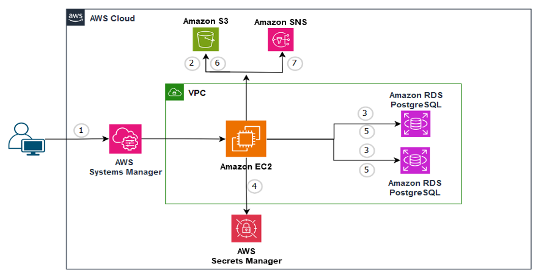
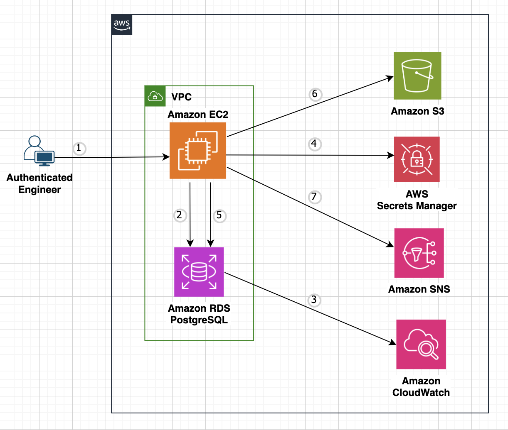
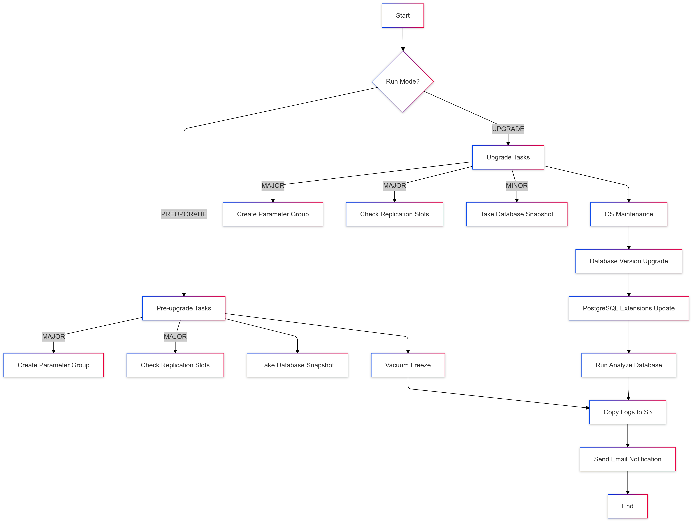

# Automate PostgreSQL Version Upgrades on Amazon RDS

Managing the lifecycle of your PostgreSQL database is essential for maintaining optimal performance, security, and feature access. Even with Amazon RDS for PostgreSQL simplifying operations, version upgrades remain a critical task for database administrators, especially in large-scale deployments. Manual upgrades can introduce challenges such as extended downtime and potential human errors, both of which can disrupt application stability.

Automation can help address these challenges. By leveraging AWS Command Line Interface (CLI) commands within a Unix shell script, you can automate the upgrade process, including prerequisite checks and upgrading a single RDS instance. To scale this approach for multiple instances, you can integrate with AWS System Manager using RDS tag strategy to upgrade entire fleet of RDS instances across multiple environments—such as Development, Staging, and Production—in a consistent and automated manner.

This repository will guide you through setting up automation for pre-upgrade checks and upgrading one or more RDS instances.

<br>

## Table of Contents
- [Features](#features)
- [Architecture](#architecture)
  - [Upgrade fleet of RDS PostgreSQL instances using AWS Systems Manager](#upgrade-fleet-of-rds-postgresql-instances-using-aws-systems-manager-1)
  - [Upgrade single RDS PostgreSQL instance](#upgrade-single-rds-postgresql-instance)
- [High-level Tasks with PREUPGRADE and UPGRADE options](#high-level-tasks-with-preupgrade-and-upgrade-options)
  - [PREUPGRADE Tasks](#preupgrade-tasks)
  - [UPGRADE Tasks](#upgrade-tasks)
- [Flow Charts](#flow-charts)
  - [Upgrade fleet of RDS PostgreSQL instances using AWS Systems Manager](#upgrade-fleet-of-rds-postgresql-instances-using-aws-systems-manager-1)
  - [Upgrade single RDS PostgreSQL instance](#upgrade-single-rds-postgresql-instance-1)
- [Setup](#setup)
  - [Setup - Upgrade fleet of RDS PostgreSQL instances using AWS Systems Manager](#setup---upgrade-fleet-of-rds-postgresql-instances-using-aws-systems-manager)
  - [Setup - Upgrade single RDS PostgreSQL instance](#setup---upgrade-single-rds-postgresql-instance)
- [Testing](#testing)
- [Log Files](#log-files)
- [Conclusion](#conclusion)

<br>

## Features

- Automate Amazon RDS PostgreSQL version upgrades
- Perform prerequisite checks before upgrading
- Upgrade a single RDS instance
- Scale the upgrade process to multiple RDS PostgreSQL instances
- Integrate with AWS System Manager for fleet-wide upgrades

<br>

## Architecture

## Upgrade fleet of RDS PostgreSQL instances using AWS Systems Manager



      1. User connects to AWS Systems Manager console and execute automation job
      2. Connects to S3 and downloads the upgrade shell script to ec2 instance
      3. Connects to ec2 instance and identifies list of RDS PostgreSQL instances based on tag key/value pair: For e.g.: UpgradeDB = Y
      4. For each RDS PostgreSQL Instance identified, configures RDS instance to push DB and upgrade logs to CloudWatch if not configured already
      5. Retrieves secret from secret manager
      6. Performs upgrade
      7. Pushes log files to S3
      8. Sends email notification.

<br>



      1. User connects to EC2 and executes the upgrade script
      2. Checks if RDS instance is valid
      3. Configures RDS instance to push DB and upgrade logs to CloudWatch if not configured already
      4. Retrieves secret from secret manager
      5. Performs upgrade tasks
      6. Pushes log files to S3
      7. Sends email notification.

<br>

## High-level Tasks with PREUPGRADE and UPGRADE options

### PREUPGRADE Tasks

      1. Create new parameter group when upgrade type = Major
      2. Check replication slot(s) when upgrade type = Major
      3. Take database snapshot
      4. Vacuum freeze.

<br>

### UPGRADE Tasks

      1. Create new parameter group when upgrade type = Major
      2. Take database snapshot when upgrade type = Minor (for Major, pre-upgrade snapshot is taken by default db_upgrade "modify-db-instance" call)
      3. Drop replication slot(s) when upgrade type = Major if variable db_drop_replication_slot is set to Y
      4. OS maintenance (pending maintenance)
      5. Database version upgrade
      6. PostgreSQL extensions update
      7. Run analyze database.
      
<br>

<details>

<summary><b>Click to expand/collapse Flow Charts</b></summary>

## Flow Charts

### Upgrade fleet of RDS PostgreSQL instances using AWS Systems Manager


### Upgrade single RDS PostgreSQL instance


</details>

<br>

## Setup

### Setup - Upgrade fleet of RDS PostgreSQL instances using AWS Systems Manager

1. Prerequisites
   
   ```
     a. AWS resources required:
   
        i. EC2 instance primarily to store and run upgrade script, and store log files.
   
               - Required Tools:
                     -- AWS CLI
                     -- PostgreSQL client utility
                     -- jq for JSON processing
                     -- bc (basic calculator utility)

                   Below commands can be used to install these utilities if required.
   
                       sudo yum install -y epel-release
                       sudo yum install -y bc jq
                       sudo yum install -y postgresql15
                       which bc jq psql

        ii. IAM profile attached to EC2 instance with necessary permissions.
   
                - Refer to [create_rds_psql_instance_cfn.yaml] file for required permissions.
                         Note: Modify resource names appropriately
   
                - Attach this IAM role to ec2 instance

        iii. RDS instance(s) with:
   
                - VPC configuration
                - Subnet group(s)
                - Security group(s)
                - Parameter group
                - AWS Secrets Manager secret attached to each RDS instance
                - Refer to [create_rds_psql_instance_cfn.yaml] file for required permissions.
                      Note: Modify resource names appropriately
      
        vi. S3 bucket to store scripts and logs (optional)
   
        v. SNS topic for notifications (optional)

     b. Network Configuration.
   
        - Database security group must allow inbound traffic from EC2 instance

2. Upload unix shell script *[rds_psql_patch.sh]* from this repo to S3 bucket

3. Create maintenance database user account in RDS PostgreSQL instance like below. This is required to create/drop replication slots, run analyze and vacuum commands, and upgrade pg extensions. This is to avoid using RDS master user account.

      ```
            CREATE USER rds_maintenance_user WITH PASSWORD 'xxxxxxxxxxxxxxx';
            GRANT rds_superuser TO rds_maintenance_user;
      ```

4. Create a secret to store database maintenance user credentials using below AWS CLI command.

    ```
      - Sample AWS CLI command to create secret
      aws secretsmanager create-secret \
            --name "<RDS Instance ID>-maintenance-user-secret" \
            --description "Maintenance user credentials for PostgreSQL RDS instance" \
            --secret-string "{\"username\":\"rds_maintenance_user\",\"password\":\"xxxxxxxxxxxxxxx\"}"
    ```

5. Add a tag to RDS PostgreSQL instance using AWS CLI command. This is required for the upgrade process to perform mainatenance tasks in the database that are part of this upgrade.

    ```
      - Expected RDS tags for secret
            - Tag Name: rds-maintenance-user-secret
            - Secret Name: <RDS Instance ID>-maintenance-user-secret            
            - DB Maintenance User Name: rds_maintenance_user

      - Sample AWS CLI command to add secret tag to an RDS PostgreSQL instance
      aws rds add-tags-to-resource \
            --resource-name arn:aws:rds:<AWS-REGION>:<AWS-ACCOUNT-NUMBER>:db:<DB instance ID> \
            --tags Key=rds-maintenance-user-secret,Value=<RDS Instance ID>-maintenance-user-secret
    ```
    
6. Create SSM automation document using CFN *[create_ssm_rds_patch_automation_document.yaml]*
         Note: Modify resource names appropriately

7. Identify minor or major upgrade path. Below is an example AWS CLI command to identify appropriate upgrade path for RDS PostgreSQL 14.12.
 
      ```
            aws rds describe-db-engine-versions \
              --engine postgres \
              --engine-version 14.12 \
              --query "DBEngineVersions[].ValidUpgradeTarget[].{EngineVersion:EngineVersion,IsMajorVersionUpgrade:IsMajorVersionUpgrade}" \
              --output table

            --------------------------------------------
            |         DescribeDBEngineVersions         |
            +----------------+-------------------------+
            |  EngineVersion |  IsMajorVersionUpgrade  |
            +----------------+-------------------------+
            |  14.13         |  False                  |
            |  14.14         |  False                  |
            |  14.15         |  False                  |
            |  15.4          |  True                   |
            |  15.5          |  True                   |
            |  15.6          |  True                   |
            |  15.7          |  True                   |
            |  15.8          |  True                   |
            |  15.9          |  True                   |
            |  15.10         |  True                   |
            |  16.3          |  True                   |
            +----------------+-------------------------+

            Based on the above output:
      
                  - For version 14.12, 14.13 thru 14.15 are valid minor version upgrade paths.
                  - For version 14.12, 15.4 thru 16.3 are valid major version upgrade paths.
      ```

8. Execute SSM automation document "RDSPostgreSQLFleetUpgrade"
      - Identify major or minor version upgrade path as shown in the previous section
      - Provide appropriate input parameters. See below screenshots.
            -- Input parameters in SSM console
            

            -- SSM automation job: Status
      
            

            -- SSM automation steps (1 and 2): Status
      
      

<br>

### Setup - Upgrade single RDS PostgreSQL instance

1. Prerequisites from the above section apply to this section as well.
   
2. Clone the repository.
   ```
   git clone https://github.com/aws-samples/rds-postgres-upgrade.git
   ```
   
3. Navigate to the project directory.
   ```
   cd rds-postgres-upgrade
   ```

4. Grant execute permission on the shell script.

   ```
   chmod u+x rds_psql_patch.sh
   ```

5. Identify minor or major upgrade path as mentioned in the above section.

6. Update environment variables in the shell script *[rds_psql_patch.sh]*, if required (optional).

7. Execute upgrade process.

      a. Set up log file location in the environment (optional).
         If this variable is not set, log files will not be copied over to S3 bucket.
   
            export S3_BUCKET_PATCH_LOGS="<s3-bucket-name>"
   
            e.g.: export S3_BUCKET_PATCH_LOGS="s3-rds-psql-patch-test-bucket"
   
      b. Configure email notification (optional).
         If this variable is not set, this process will not send notification at the end of this upgrade process.
   
            export SNS_TOPIC_ARN_EMAIL="<sns-topic-arn>"
   
            e.g.: export SNS_TOPIC_ARN_EMAIL="arn:aws:sns:us-east-1:11111111111:sns-rds-psql-patch-test-sns-topic"
           
      c. Execute upgrade script.

               ./rds_psql_patch.sh [db-instance-id] [next-engine-version] [run-pre-check]
   
               e.g.: ./rds_psql_patch.sh rds-psql-patch-test-1 15.6 PREUPGRADE

               PREUPGRADE = Run pre-requisite tasks, and do NOT run upgrade tasks
               UPGRADE = Do not run pre-requisite tasks, but run upgrade tasks
      
               Note: Review this document [https://docs.aws.amazon.com/AmazonRDS/latest/PostgreSQLReleaseNotes/postgresql-versions.html]
                     for appropriate minor or major supported verion (a.k.a appropirate upgrade path)
      
8. Example Usage:
   
           a. Preupgrade process exeuction:

               export S3_BUCKET_PATCH_LOGS="s3-rds-psql-patch-test-bucket"
               export SNS_TOPIC_ARN_EMAIL="arn:aws:sns:us-east-1:11111111111:sns-rds-psql-patch-test-sns-topic"
               nohup ./rds_psql_patch.sh rds-psql-patch-instance-1 14.10 PREUPGRADE >rds-psql-patch-instance-1-preupgrade-`date +'%Y%m%d-%H-%M-%S'`.out 2>&1 &

           b. Upgrade process exeuction

               export S3_BUCKET_PATCH_LOGS="s3-rds-psql-patch-test-bucket"
               export SNS_TOPIC_ARN_EMAIL="arn:aws:sns:us-east-1:11111111111:sns-rds-psql-patch-test-sns-topic"
               nohup ./rds_psql_patch.sh rds-psql-patch-instance-1 14.15 UPGRADE >rds-psql-patch-instance-1-upgrade-`date +'%Y%m%d-%H-%M-%S'`.out 2>&1 &

<br>

## Testing
To perform end-to-end testing of this process using AWS System Manager, perform below steps using AWS Console:

**Note**: This will create VPC, subnets, routes, ec2, RDS, security groups, IAM policy/role, NAT, IGW, EIP and others. 

1. Run CloudFormation scrtipt [create_rds_psql_instance_cfn.yaml] to create complete test stack with input parameter values.

2. Run CloudFormation script [create_ssm_rds_patch_automation_document.yaml] to create SSM automation document.

3. Upload RDS patch shell script [rds_psql_patch.sh] to S3 bucket created in Step 1 above.

4. Create maintenance database user account in RDS PostgreSQL instance like below. This is required to create/drop replication slots, run analyze and vacuum commands, and upgrade pg extensions. This is to avoid using RDS master user account. 

Note:
Use the same password that is in the "<RDS Instance ID>-maintenance-user-secret" secret which would have been created during Step #1 above.

      ```
            CREATE USER rds_maintenance_user WITH PASSWORD 'xxxxxxxxxxxxxxx';
            GRANT rds_superuser TO rds_maintenance_user;
      ```

5. Execute automation document from AWS Systems Manager console (as per Step 4 of the section "Upgrade fleet of RDS PostgreSQL instances using AWS Systems Manager").

Note: 
1. To create a replication slot in an RDS PostgreSQL instance, set rds.logical_replication=1 in the RDS instance parameter file and reboot the instance.
2. Then, use the command like "SELECT pg_create_logical_replication_slot('slot_psql_patch_test','test_decoding');" to create a replication slot.

<br>

## Log Files

Below log files will be generated in the logs directory for each option

<br>

### PREUPGRADE

| Log File Type | Purpose | Sample File Name |
|---------------|---------|-------------------|
| Master Log | Master log file that will have log summary (highlights) for each database pre-upgrade activity | upgrade_master-20250118-02-04-15.log |
| Pre-upgrade Execution Log | Main execution log for pre-upgrade tasks | preupgrade-rds-psql-patch-test-1-20230615-14-30-45.out |
| Freeze Task Log | Log of VACUUM FREEZE command execution | run_db_task_freeze-20230615-14-30-45.log |
| Replication Slot Log | Log of replication slot operation (major upgrades only) | replication_slot_20230615-14-30-45.log |

<br>

### UPGRADE

| Log File Type | Purpose | Sample File Name |
|---------------|---------|-------------------|
| Master Log | Master log file that will have log summary (highlights) for each database upgrade activity | upgrade_master-20250118-02-04-15.log |
| Upgrade Execution Log | Main execution log for upgrade tasks | upgrade-rds-psql-patch-test-1-20230615-14-30-45.out |
| Current DB Configuration Backup | Backup of current DB configuration before upgrade | db_current_config_backup_postgres15-20230615-14-30-45.txt |
| Replication Slot Log | Log of replication slot operation (major upgrades only) | replication_slot_20230615-14-30-45.log |
| Extension Update Log | Log of PostgreSQL extension updates | update_db_extensions_20230615-14-30-45.log |
| Analyze Task Log | Log of ANALYZE command execution | run_db_task_analyze-20230615-14-30-45.log |

<br>

## Additional commands (if required)

1. Command to create RDS maintenace user.

     ```
            CREATE USER rds_maintenance_user WITH PASSWORD '799LlqsloRihFYEfJ5';
            GRANT rds_superuser TO rds_maintenance_user;
     ```

2. Command to create a replication slot.

      ```
            SELECT * FROM pg_replication_slots;
            SELECT pg_create_logical_replication_slot('my_slot', 'test_decoding');
            SELECT * FROM pg_replication_slots;
     ```

3. Command to drop all replication slots.

      ```
            SELECT * FROM pg_replication_slots;
            SELECT pg_drop_replication_slot(slot_name) FROM pg_replication_slots WHERE slot_name IN (SELECT slot_name FROM pg_replication_slots);
            SELECT * FROM pg_replication_slots;
     ```

<br>

## Conclusion

The scalable solution automates RDS for PostgreSQL pre-upgrade and upgrade tasks, reducing manual effort and potential errors. With built-in logging and optional email notifications, it provides real-time visibility and comprehensive tracking. By optionally storing logs in S3, you benefit from a cost-effective solution that ensures logs are readily available for analysis, audits, and compliance purposes.

<br>

## Disclaimer

We recommend you deploy and validate this solution in a non-production environment first prior to using it in production environment.

This README provides an overview of your script, including its purpose, how to use it, prerequisites, and a brief description of its functions and environment variables. It also includes some usage examples and notes about the script's behavior. You can adjust or expand this README as needed to provide more detailed information about your script.

<br>

## Contributing

Contributions are welcome! If you have any ideas, suggestions, or bug reports, please open an issue or submit a pull request.

<br>

## Security

See [CONTRIBUTING](CONTRIBUTING.md#security-issue-notifications) for more information.

<br>

## License

This library is licensed under the MIT-0 License. See the LICENSE file.
